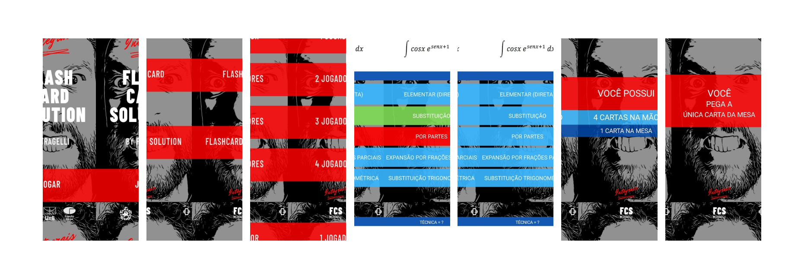

## 1. Introducação

Este artefato documenta o processo de pesquisa realizado para identificar as principais funcionalidades e oportunidades de melhoria do aplicativo do Fragelli, um jogo de cartas digital voltado para grupos de estudantes de cálculo. Além de apresentar as vantagens e desvantagens levantadas antes da aplicação do questionário, este documento detalha a pesquisa conduzida através de um questionário direcionado ao proprietário do aplicativo. O objetivo foi compreender sua visão sobre as funcionalidades essenciais, a usabilidade e as possíveis expansões do produto, fornecendo uma base sólida para aprimorar a experiência do usuário e aumentar a eficácia do aplicativo.

## 2. Mercado de Aplicaticativo Gamificado

O mercado de gamificação tem crescido exponencialmente, mostrando-se uma estratégia eficaz em diversos setores, especialmente em educação e produtividade. Com um potencial imenso para atrair e engajar usuários, a gamificação aplica mecânicas de jogos, como metas, recompensas e níveis, a atividades do cotidiano ou de aprendizado, tornando as coisas mais motivadoras. O melhor exemplo disso é o Duolingo que transformou o aprendizado de línguas em uma experiência semelhante a um jogo, que fez a plataforma conseguiu conquistar mais de 500 milhões de usuários globalmente.

> Fonte: https://pingback.com/alavancas/como-o-duolingo-usou-gamification-para-adquirir-500-milhoes-de-usuarios

## 3. Ideia de Produto

FlashCard Solution - Fragelli

> *Distribuído por Ricardo Fragelli*

FlashCard Solution é um jogo educacional que envolve questões relacionadas à resolução de integrais. Ele utiliza um sistema de cartas para apresentar diferentes técnicas de integração, como substituição, por partes, e frações parciais. O jogo oferece opções para um ou mais jogadores, sugerindo um formato competitivo ou colaborativo, onde os participantes escolhem a técnica correta para resolver a integral apresentada.

## 4. Prós e Contras

| Prós | Contras |
|-|-|
|**Gamificação do aprendizado**: O uso de mecânicas de jogos (cartas, pontuações) ajuda a tornar o aprendizado mais envolvente e divertido. Isso pode aumentar o engajamento dos usuários, principalmente em contextos educacionais complexos, como o estudo de integrais. |**Publico Específico**: Por estar focado em integrais e técnicas matemáticas avançadas, o público-alvo do aplicativo é limitado a estudantes de engenharias. Isso pode restringir o crescimento e a adoção ampla, especialmente em comparação com plataformas educacionais mais generalistas. |
|**Flexibilidade no ensino de técnicas**: O foco do aplicativo em ensinar técnicas de integração oferece uma abordagem prática e focada, permitindo que os usuários pratiquem e reforcem conceitos específicos de cálculo, o que pode ser útil em preparação para exames ou revisões rápidas.| **Complexidade de desenvolvimento**: Implementar um sistema de jogo com múltiplos modos e mecânicas de cartas requer mais complexidade no desenvolvimento.|

## 5. Questionário

O sucesso de um software vai além da tecnologia e depende da compreensão do   e das expectativas dos usuários. Este questionário foi elaborado para coletar informações essenciais sobre as preferências do mercado, as dores do usuário e a usabilidade do produto, contribuindo para um desenvolvimento mais assertivo e direcionado.

1. Quais funcionalidades você considera essenciais que devem ser mantidas no aplicativo?
2. Você acha que a interface do aplicativo está fácil de usar? Se não, quais pontos você acha que precisam de melhoria?
3. O que poderia ser adicionado ou modificado para tornar o jogo mais envolvente?
4. Você gostaria de expandir a cobertura de conteúdos do aplicativo?
5. Existe algum novo modo de jogo ou funcionalidade relacionada ao jogo que você gostaria de ver no aplicativo?
6. Você gostaria de mais interações entre jogadores como rankings ou desafios?

## Conclusão

Ainda não tivemos uma resposta direta do dono do aplicativo Fragellis - 28/10/2024

# 7. Referências

> Pingback. (s.d.). Como o Duolingo usou gamification para adquirir 500 milhões de usuários. Acesso em 28 de outubro de 2024, de https://pingback.com/alavancas/como-o-duolingo-usou-gamification-para-adquirir-500-milhoes-de-usuarios

> Duda, V. B. S. (s.d.). A magia da gamificação no Duolingo: aprendizado como um jogo. Medium. Acesso em 28 de outubro de 2024, de https://medium.com/@vbsduda/a-magia-da-gamifica%C3%A7%C3%A3o-no-duolingo-aprendizado-como-um-jogo-57de264ab897

| Versão | Data | Data Prevista de Revisão | Descrição | Autor(es) | Revisor(es) |
| :------: | :----------: | :-----------: | :-----------: | :---------: | :---------: |
| `1.0` | 28/10/2024 | - | Descrição de mercado - App Gamificado FlashCards Solution | [Danilo Naves](https://github.com/DaniloNavesS), [Paulo Henrique](https://github.com/paulomh) | - |