## <a>1. Introdução </a>

Este artefato documenta o processo de pesquisa realizado para identificar as principais necessidades e preferências dos alunos do ensino médio em relação a um aplicativo de estudos para o ENEM, um dos temas debatidos durante o [Brainstorming](https://unbarqdsw2024-2.github.io/2024.2_G3_Aprender_Entrega_01/#/DesignSprint/brainstorming). Este documento detalha as etapas de elaboração do questionário, a coleta de dados e a análise das respostas, visando servir como base para o entendimento dos recursos e funcionalidades mais desejados pelo público-alvo. 

## <a>2. Metodologia </a>

De acordo com BARBOSA e SILVA (2021)<a id="anchor_1" href="#REF1">^1^</a>, a ferramenta 5W2H é uma metodologia estruturada para o planejamento e execução de ações, amplamente utilizada para proporcionar clareza e eficiência em projetos e processos. Baseada nas perguntas (What, Why, Where, When, Who, How, e How much), essa técnica permite definir e detalhar atividades de forma prática, facilitando o entendimento e a comunicação entre todos os envolvidos. Cada uma dessas questões orienta aspectos fundamentais de um plano, garantindo que os objetivos estejam claros e que todos os passos necessários sejam considerados.

No contexto de um questionário, a aplicação do 5W2H ajuda a estruturar perguntas que exploram diferentes perspectivas, oferecendo um panorama completo sobre o tema estudado. Essa abordagem permite que cada item do questionário seja elaborado para obter informações detalhadas e direcionadas, considerando desde a motivação e os objetivos até os métodos e recursos necessários. Assim, a utilização da técnica 5W2H em questionários contribui para um levantamento de dados mais preciso e estruturado.

### <a>2.1 Descrição da ideia - 5W2H </a>

### <a>2.1.1 What (O que)? </a>
Um questionário voltado para entender as principais funcionalidades que um aplicativo de estudo para o ENEM deve ter.

### <a>2.1.2 Why (Por quê)? </a>
Centralizar as expectativas e necessidades dos alunos, permitindo que eles expressem suas preferências em relação às funcionalidades do aplicativo, facilitando assim o desenvolvimento de uma ferramenta mais alinhada às suas necessidades.

### <a>2.1.3 Who (Quem)? </a>
Alunos do ensino médio que estão se preparando para o ENEM, bem como recém-formados que desejam compartilhar suas experiências.

### <a>2.1.4 Where (Onde?)? </a>
O questionário será compartilhado em grupos de alunos de ensino médio.

### <a>2.1.5 When? </a>
A aplicação ocorrerá de maneira assíncrona, podendo ser respondido a qualquer momento

### <a>2.1.6 How? </a>
Os alunos responderão a perguntas específicas sobre funcionalidades desejadas, experiências anteriores com aplicativos de estudo e sugestões de melhorias. As respostas serão coletadas e analisadas para orientar o desenvolvimento do aplicativo.

### <a>2.1.7 How Much? </a>
A participação no questionário será gratuita e incentivará o envolvimento dos alunos no processo de desenvolvimento do aplicativo.

## <a>3. Formulário de pesquisa </a>

O [formulário de pesquisa](https://forms.gle/DnHXgJCKbL9YE5MA6), foi desenvolvido por meio do [Google Forms](https://www.google.com/intl/pt-BR/forms/about/)<a id="anchor_2" href="#REF2">^2^</a>, e conta com 13 perguntas voltadas para explorar as necessidades e expectativas dos usuários em relação a um aplicativo de estudos para o ENEM. Abaixo, as imagens de 1 a 4 mostram cada uma das perguntas que compõem o questionário:

<figure markdown>

<b>Imagem 1</b> - Perguntas do questionário

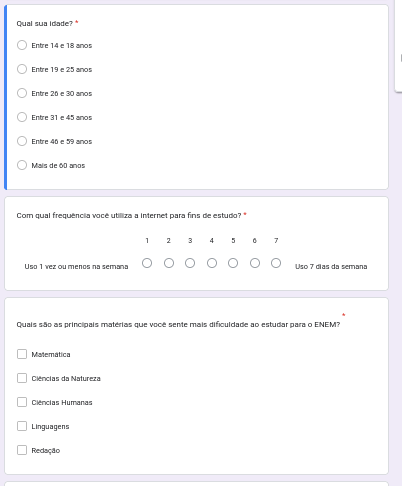 

Fonte: [João Artur Leles](https://github.com/joao-artl)

</figure>

<figure markdown>

<b>Imagem 2</b> - Perguntas do questionário

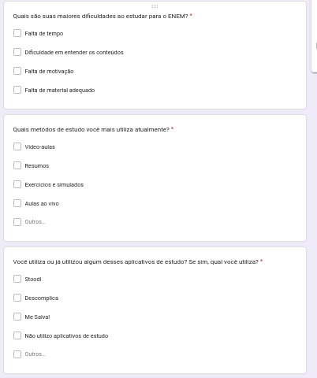 

Fonte: [João Artur Leles](https://github.com/joao-artl)

</figure>

<figure markdown>

<b>Imagem 3</b> - Perguntas do questionário

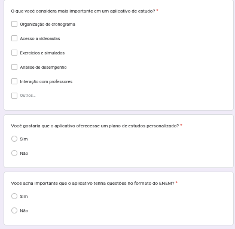 

Fonte: [João Artur Leles](https://github.com/joao-artl)

</figure>

<figure markdown>

<b>Imagem 4</b> - Perguntas do questionário

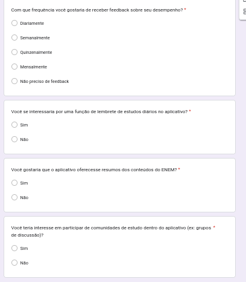 

Fonte: [João Artur Leles](https://github.com/joao-artl)

</figure>

## <a>4. Divulgação </a>
O questionário foi enviado para grupos de estudantes recém-graduados e para estudantes do terceiro ano do ensino médio, público que possui contato próximo com o ENEM, seja por meio da preparação ou pela experiência recente de terem realizado o exame. Esse perfil de participantes foi selecionado com o intuito de capturar percepções e expectativas autênticas sobre as principais funcionalidades desejadas em um aplicativo de estudo para o ENEM, considerando tanto as necessidades dos que ainda estão se preparando quanto os insights daqueles que já passaram pelo processo.

## <a>5. Resultados da Pesquisa </a>
Obtivemos um total de 25 respostas ao questionário.

### <a>5.1 Faixa Etária </a>
A faixa etária predominante entre os respondentes é de jovens de 14 a 18 anos, seguida por aqueles de 19 a 24 anos, conforme mostrado na Imagem 5.

<figure markdown>

<b>Imagem 5</b> - Faixa Etária

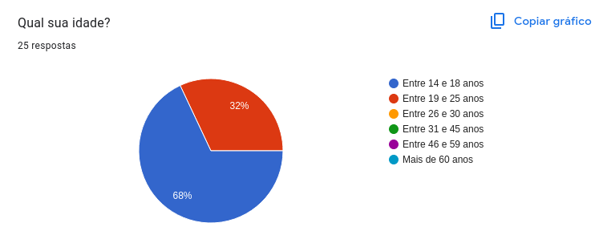 

Fonte: [João Artur Leles](https://github.com/joao-artl)

</figure>

### <a>5.2 Principais Dificuldades no Estudo </a>
Uma das principais dificuldades enfrentadas pelos alunos é entender o conteúdo e manter-se motivado, conforme ilustrado na Imagem 6.

<figure markdown>

<b>Imagem 6</b> - Principais Dificuldades no Estudo

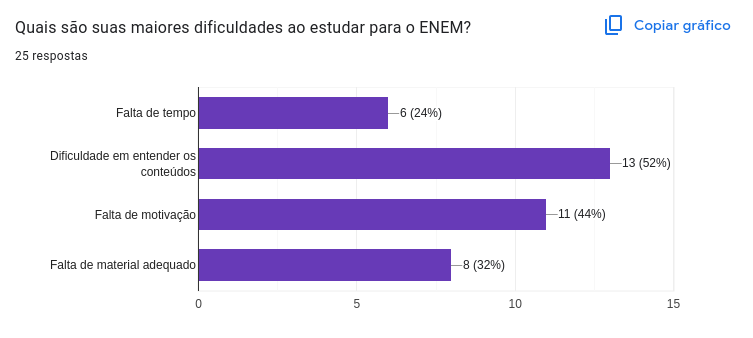 

Fonte: [João Artur Leles](https://github.com/joao-artl)

</figure>

### <a>5.3 Importância dos aplicativos de estudo </a>
A maioria dos usuários já utilizou aplicativos de estudo, como demonstrado na Imagem 7.

<figure markdown>

<b>Imagem 7</b> - Importância dos aplicativos de estudo

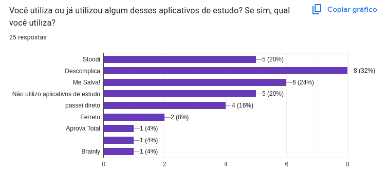 

Fonte: [João Artur Leles](https://github.com/joao-artl)

</figure>

### <a>5.4 Notificações sobre Estudo </a>
A maioria dos usuários gostaria de ter uma função de notificações sobre estudos, conforme indicado na Imagem 8.

<figure markdown>

<b>Imagem 8</b> - Notificações sobre Estudo

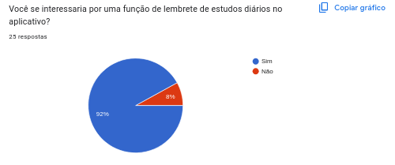 

Fonte: [João Artur Leles](https://github.com/joao-artl)

</figure>

### <a>5.5 Fórum para Debates de Questões </a>
As respostas sobre a presença ou não de fóruns de discussão mostraram resultados divergentes, o que sugere a necessidade de uma análise mais aprofundada sobre sua real importância, conforme mostrado na Imagem 9.

<figure markdown>

<b>Imagem 9</b> - Fórum para Debates de Questões

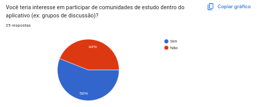 

Fonte: [João Artur Leles](https://github.com/joao-artl)

</figure>

### <a>5.6 Importância da Resolução de questões </a>
O questionário revelou que a maioria dos alunos busca, como método de estudo, a resolução de questões, conforme apresentado nas Imagens 10, 11 e 12.

<figure markdown>

<b>Imagem 10</b> - Importância da Resolução de questões

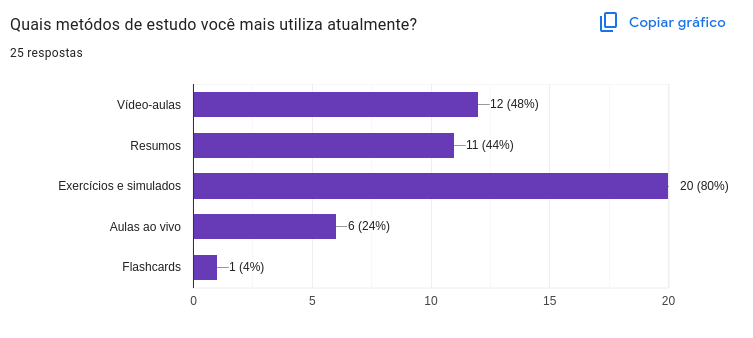 

Fonte: [João Artur Leles](https://github.com/joao-artl)

</figure>

<figure markdown>

<b>Imagem 11</b> - Importância da Resolução de questões

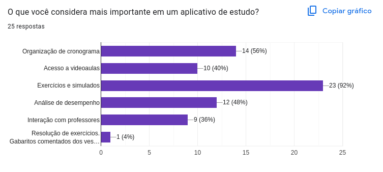 

Fonte: [João Artur Leles](https://github.com/joao-artl)

</figure>

<figure markdown>

<b>Imagem 12</b> - Importância da Resolução de questões

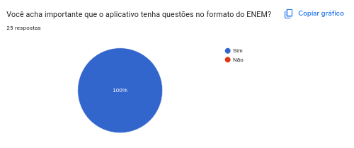 

Fonte: [João Artur Leles](https://github.com/joao-artl)

</figure>

## <a>6. Análise e conclusão </a>

Em conclusão, a pesquisa mostra que o tema é viável, com alguns alunos demonstrando interesse em colaborar no desenvolvimento do aplicativo de estudos para o ENEM. O auxílio deles pode fornecer insights sobre as funcionalidades essenciais e garantir que elas se alinhem com as necessidades dos usuários.

## <a>Referências Bibliográficas</a>

> <a id="REF1" href="#anchor_1">1.</a> Barbosa, S. D. J.; Silva, B. S. da; Silveira, M. S.; Gasparini, I.; Darin, T.; Barbosa, G. D. J. (2021) *Interação Humano-Computador e Experiência do usuário.* Capítulo 13 Tópicos Especiais, tópico 13.1 Gamificação, página 325. Autopublicação. ISBN: 978-65-00-19677-1.

> <a id="REF2" href="#anchor_2">2.</a> Google Forms. Disponível em: [https://www.google.com/intl/pt-BR/forms/about/](https://www.google.com/intl/pt-BR/forms/about/). Acesso em: 27 de out de 2024

## <a>Histórico de Versão</a>

| Versão | Data | Data Prevista de Revisão | Descrição | Autor(es) | Revisor(es) |
| :------: | :----------: | :-----------: | :-----------: | :---------: | :---------: |
| `1.0` | 27/10/2024 | 28/10/2024 | Criação do Documento| [João Artur Leles](https://github.com/joao-artl) | [Arthur Alves](https://github.com/Arthrok) |