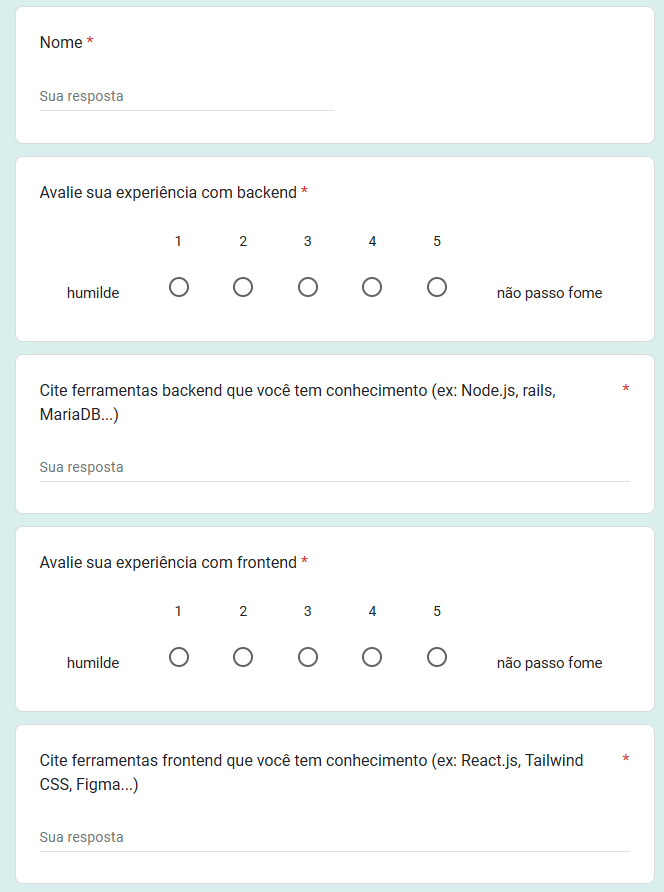
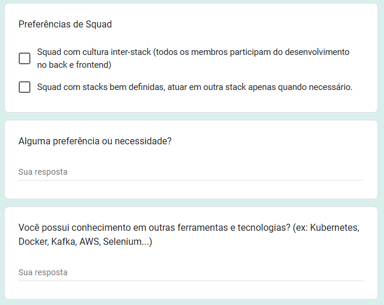

# Desenvolvimento dos *Squads*

## 1. Introdução

Este documento apresenta o planejamento da equipe em relação ao projeto, citando as metodologias organizacionais e de desenvolvimento que serão aplicadas, bem como a divisão de tarefas e responsabilidades entre os membros do squad. A estruturação dos *squads* é essencial para garantir a eficiência e a colaboração entre os integrantes, visando atingir os objetivos propostos.

## 2. Metodologia

A equipe atual é composta por 12 membros com diferentes habilidades e experiências, o que permite a divisão em *squads* especializados em áreas específicas do projeto. Inicialmente foi escolhido um líder geral para a equipe, o papel foi designado ao estudante [Giovanni](https://github.com/giovanniacg), que será responsável por coordenar as atividades e garantir a comunicação eficaz da equipe.

Posteriormente, visto a necessidade de organização e divisão de tarefas, além da equipe numerosa, foi proposta a divisão em 3 *squads* de 4 membros, cada um com um líder responsável por coordenar as atividades do grupo. Portanto, cada *squad* será independente e terá seus próprios rituais e organização interna, porém, ainda existirão reuniões gerais com todos os *squads* ou no mínimo com seus líderes para alinhamento e acompanhamento do projeto.

Para a divisão dos *squads*, foi elaborado um formulário para o conhecimento das habilidades e preferências de cada membro, a fim de formar equipes equilibradas e eficientes. A partir dessas decisões, foi acordado que em cada *squad* haverá 2 membros com experiência em desenvolvimento front-end e 2 membros com experiência em desenvolvimento back-end, garantindo a diversidade de habilidades e conhecimentos em cada equipe, podendo ter cooperação dentre todos os membros com o que desejar.

Todo esse processo foi baseado em uma semelhante à metodologia Spotify, porém em menor escala.

### 2.1 Formulário de Divisão de *Squads*

<figure markdown>

<b>Imagem 1</b> - Primeiro <i>print</i> do formulário

Fonte: [Giovanni Giampauli](https://github.com/giovanniacg)

</figure>

<figure markdown>

<b>Imagem 2</b> - Segundo <i>print</i> do formulário

Fonte: [Giovanni Giampauli](https://github.com/giovanniacg)

</figure>

## 3. Análise e Conclusão

A equipe, ao todo, optou por adotar a metodologia de *squads* para garantir a eficiência e a colaboração entre os membros, bem como a divisão de tarefas e responsabilidades.

A divisão dos *squads* resultou nos seguintes grupos, com cada líder estando em negrito:

| Squad 1 | Squad 2 | Squad 3 |
|:-------:|:-------:|:-------:|
| [Arthur Alves](https://github.com/arthrok) | [Ana Carolina Costa César](https://github.com/CarolCoCe) | [Danilo Naves](https://github.com/DaniloNavesS) |
| [Diego Sousa](https://github.com/DiegoSousaLeite) | [Felipe Motta](https://github.com/M0tt1nh4) | [Eric Silveira](https://github.com/ericbky) |
| [Julio Cesar](https://github.com/julio-dourado) | [Giovanni Giampauli](https://github.com/giovanniacg) | [Gustavo Melo](https://github.com/gusrberto) | 
| [Paulo Henrique](https://github.com/paulomh) | [João Artur Leles](https://github.com/joao-artl) | [Luiz Gustavo](https://github.com/LuizGust4vo) |

## Referências Bibliográficas

> <a id="REF1" href="#anchor_1">1.</a> CRUTH, M. Descubra o modelo do Spotify. ATLASSIAN. Disponível em: https://www.atlassian.com/br/agile/agile-at-scale/spotify.

## Histórico de Versão

| Versão | Data       | Data de Revisão          | Descrição            | Autor(es)                       | Revisor(es)                       | Detalhes da revisão        |
| ------ | ---------- | ------------------------ | -------------------- | ------------------------------- | --------------------------------- | -------------------------- |
| `1.0` | 04/11/2024 | DD/MM/AAAA | Criação do documento | [Felipe Motta](https://github.com/M0tt1nh4) | --- | --- |