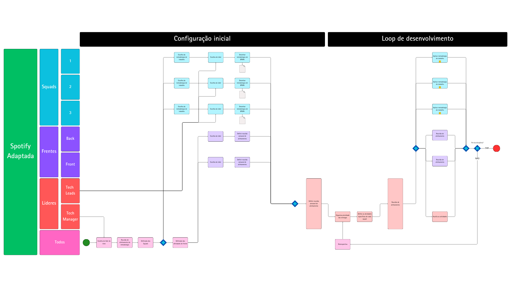

## <a>1. Introdução</a>

Para estruturar a organização do projeto e melhorar a eficiência da equipe, foi adotada a Metodologia Spotify<a>^1^</a>, um modelo de gerenciamento ágil que promove autonomia e alinhamento entre os times. O membro [Giovanni Giampauli](https://github.com/giovanniacg) criou um quadro BPMN utilizando essa metodologia e dividiu as responsabilidades do projeto entre três squads, cada um com uma função específica dentro do desenvolvimento. A colaboração em um ambiente virtual, com auxílio do Canva para criar e organizar visualmente o quadro BPMN, facilitou a comunicação entre os membros, ajudando na compreensão das funções e objetivos de cada squad.

## <a>2. Metodologia</a>

A metodologia Spotify foi adaptada para organizar o desenvolvimento do projeto, dividindo o trabalho em três squads, com foco em promover a autonomia e o alinhamento entre eles. No quadro BPMN, podemos ver que a estrutura foi organizada em duas fases principais: Configuração Inicial e Loop de Desenvolvimento.

### <a>2.1 Configuração Inicial</a>

Nessa fase, são realizados os preparativos para o funcionamento das squads e a definição das responsabilidades. A configuração inicial começa com a escolha dos membros das squads, onde os líderes têm papel ativo em montar as equipes e definir os objetivos de cada uma. As frentes de desenvolvimento foram divididas entre Back-end e Front-end, permitindo que cada squad tenha um foco específico. Além disso, o Tech Manager e os Tech Leads desempenham um papel central, supervisionando o progresso e garantindo que os times estejam alinhados com as metas do projeto.

Outras atividades incluem:

- Escolha de líderes para as squads.
- Definição de metodologia a ser utilizada.
- Definição das atividades e ferramentas para comunicação e colaboração, o que foi facilitado pelo uso do Canva para organizar visualmente as tarefas e papéis.

### <a>2.2 Loop de Desenvolvimento</a>

Após a configuração inicial, a metodologia entra no ciclo contínuo de desenvolvimento. Nesse Loop de Desenvolvimento, as squads ajustam continuamente as entregas e colaboram entre si para solucionar problemas de forma iterativa. Cada squad tem autonomia para tomar decisões dentro de sua área, mas há pontos de checagem e alinhamento com os Tech Leads e o Tech Manager, que ajudam a garantir a consistência e qualidade das entregas.

Principais etapas do loop incluem:

- Ajuste de entregas pelas squads, com revisões e correções frequentes.
- Rodadas de alinhamento entre os líderes de cada squad, onde as decisões são revistas para garantir que o desenvolvimento esteja no caminho certo.
- Avaliação do progresso e análise de entregas finais para decidir se o ciclo é encerrado ou se mais ajustes são necessários.

Esse fluxo adaptado da metodologia Spotify permitiu que a equipe dividisse as responsabilidades de forma organizada e eficiente, dando autonomia às squads para avançar em suas tarefas enquanto mantinham um alinhamento geral com os objetivos do projeto.

## <a>3. Quadro Utilizado</a>

A imagem 1 abaixo apresenta a estrutura organizacional da equipe, baseada na Metodologia Spotify:

<figure markdown>

<b>Imagem 1</b> - Estrutura Organizacional da Metodologia Spotify

 

Fonte: [Giovanni Giampauli](https://github.com/giovanniacg)

</figure>

**O quadro também pode ser visualizado no seguinte link:**

  <iframe loading="lazy" style="position: absolute; width: 100%; height: 100%; top: 0; left: 0; border: none; padding: 0;margin: 0;"
    src="https://www.canva.com/design/DAGVdz212VY/yZwtX5MlTRG58o1FSnjKcw/view?embed" allowfullscreen="allowfullscreen" allow="fullscreen">
  </iframe>

<a href="https:&#x2F;&#x2F;www.canva.com&#x2F;design&#x2F;DAGVdz212VY&#x2F;yZwtX5MlTRG58o1FSnjKcw&#x2F;view?utm_content=DAGVdz212VY&amp;utm_campaign=designshare&amp;utm_medium=embeds&amp;utm_source=link" target="_blank" rel="noopener">Metodologia Spotify</a> de Giovanni Alvissus

## <a>4. Conclusão</a>

A aplicação da Metodologia Spotify no desenvolvimento do projeto para o ENEM ajudou a organizar a equipe de forma mais eficiente, com foco na autonomia e na entrega constante de valor. As squads assumiram funções específicas, o que trouxe mais agilidade para cada parte do desenvolvimento.

Entre os principais benefícios, destacaram-se a maior flexibilidade e a redução de gargalos no trabalho, permitindo que cada squad se adaptasse rapidamente a mudanças sem perder o foco nos objetivos gerais. Para aumentar o impacto do projeto, é importante manter a comunicação ativa entre squads e incentivar a colaboração, promovendo um ambiente de aprendizado contínuo.

## <a>Referência Bibliográfica</a>
> <a>1.</a> KNIBERG, Henrik; IVARSSON, Anders. Scaling Agile @ Spotify with Tribes, Squads, Chapters & Guilds. White Paper, 2012. Disponível em: https://blog.crisp.se/wp-content/uploads/2012/11/SpotifyScaling.pdf. Acesso em: 3 nov. 2024.

## <a>Histórico de Versão  </a>

| Versão | Data       | Data de Revisão | Descrição               | Autor(es)                         | Revisor(es) | Detalhes da revisão |
| ------ | ---------- | --------------- | ----------------------- | --------------------------------- | ----------- | ------------------- |
| `1.0`    | 03/11/2024 | 03/11/2024      | Criação do documento    | [João Artur Leles](https://github.com/joao-artl)           | [Giovanni Giampauli](https://github.com/giovanniacg) | Perfeito! |
