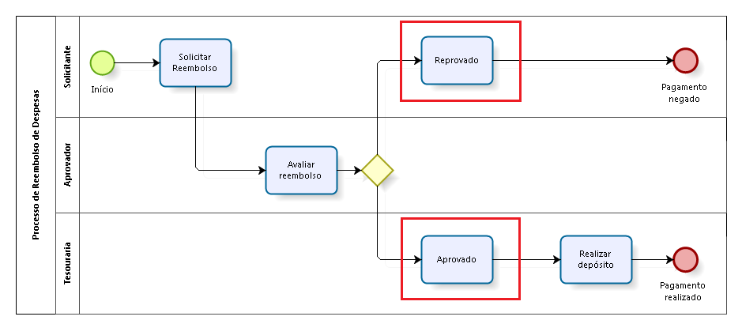
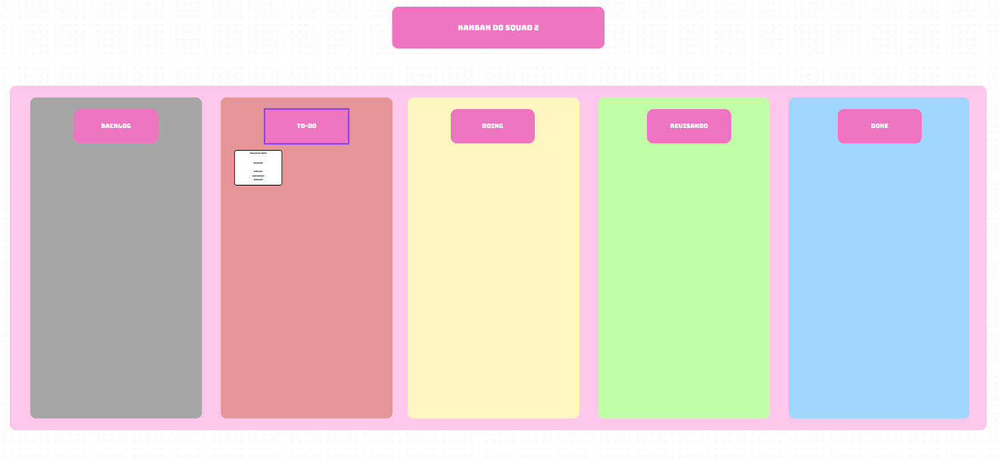

# <a> 1.3. Módulo Modelagem BPMN </a>

## <a>1.3.1 - BPMN </a>

O Business Process Model and Notation (BPMN) é uma notação gráfica padronizada para modelagem de processos. O BPMN representa fluxos de atividades em diagramas, utilizando símbolos como eventos, atividades, gateways e fluxos de sequência para descrever detalhadamente como os processos operacionais de uma organização funcionam. Sua importância se destaca especialmente em sistemas de informação e em projetos onde o entendimento do fluxo de trabalho é essencial para o desenvolvimento, manutenção e otimização de softwares que atendam às necessidades reais das empresas.

Suas principais abstrações são: pool, lane, milestone, conectores, atividades, sub-processos, call activity, eventos, gateways, item e dados.

_Fonte: Slides - Aula BPMN - Professora Milene_

### <a> Exemplos de construções de BPMN </a>

A seguir, apresentamos alguns exemplos de BPMN que ilustram técnicas semelhantes às que adotamos em nosso processo. Esses diagramas demonstram práticas que ajudam a otimizar o fluxo de trabalho e melhorar a eficiência nas entregas, servindo como referência para o nosso próprio método de gestão de processos.

<b>Imagem 1</b> - Exemplo de BPMN 1

_Fonte: https://blog.iprocess.com.br/_

<b>Imagem 2</b> - Exemplo de BPMN 2

_Fonte: https://blog.iprocess.com.br/_

## <a> 1.3.2 Metodologia </a>

A equipe ao todo decidiu reorganizar o time em pequenos squads de 4 pessoas, onde cada squad será responsável por desenvolver sua própria metodologia. Sendo assim, cada squad foi responsável por decidir sua própria metodologia de processos. É possível ver na tabela abaixo o modelo utilizado por cada equipe.

| Nº Squad | Abordagem |Metodologia |
|-------|--------------|------------|
| 1     |              |            |
| 2     | Ágil         |  Kanban    |
| 3     |Híbrida| Kanban, XP (Extreme Programming) |

<!-- ### <a> Metologia Squad 1 </a> -->

### <a> Metologia Squad 2 </a>

Optar pelo Kanban como metodologia de desenvolvimento para o Squad 2, de três desenvolvedores fullstack se alinha perfeitamente com as necessidades e dinâmicas do nosso grupo. O Kanban é uma abordagem ágil que visa a otimização do fluxo de trabalho, permitindo um gerenciamento eficiente de tarefas e aumentando a transparência nas atividades da equipe. Como demonstrado pela imagem 4, a nossa metodologia inclui melhoria contínua do processo, visualização do fluxo de trabalho com o uso de um quadro Kanban, autonomia para a resolução das tarefas, flexibilidade para as tarefas e muita comunicação, já que a equipe é bem pequena. Também contamos com revisões por parte de nossos pares para garantir a qualidade do trabalho entregue e aumentar a comunicção do trabalho realizado.

<figure markdown>

<b>Imagem 4</b> - BPMN da metodologia do Squad 2

 [Ana Carolina Costa César](https://github.com/CarolCoCe), [João Leles](https://github.com/joao-artl), [Felipe Motta](https://github.com/M0tt1nh4)

</figure>

<figure markdown>

<b>Imagem 5</b> - Kanban do Squad 2

 [Ana Carolina Costa César](https://github.com/CarolCoCe), [João Leles](https://github.com/joao-artl), [Felipe Motta](https://github.com/M0tt1nh4)

</figure>

### <a> Metologia - Squad 3 </a>

O Squad 3 optou por adotar as metodologias Kanban e Extreme Programming (XP) para o projeto, visando uma abordagem equilibrada entre organização visual e eficiência no desenvolvimento. O uso do Kanban permite que a equipe visualize de forma clara as etapas do fluxo de trabalho, facilitando a identificação de gargalos e ajudando a manter o foco nas tarefas em andamento. Isso traz uma organização transparente ao projeto, além de permitir ajustes rápidos nas atividades de acordo com as prioridades que surgem. Isso fica bastante claro quando analisar o fluxo de processo pelo modelo BPMN.

<b>Imagem 6</b> - BPMN do Squad 3

_Fonte: [Danilo Naves](https://github.com/DaniloNavesS), [Eric Silveira](https://github.com/ericbky), [Luiz Gustavo](https://github.com/LuizGust4vo), [Gustavo Roberto](https://github.com/gusrberto)_

Além disso, ao utilizar o Extreme Programming (XP), o squad 3 busca elevar a qualidade do código e garantir um ritmo sustentável de desenvolvimento. As práticas de XP, como programação em pares, revisões frequentes e aplicação de design simples e refatoração aumentam a confiança no código produzido e reduzem os riscos de problemas no futuro. Essa metodologia também reforça o feedback constante e a colaboração, que são fundamentais para que a equipe e o produto evolua no processo de desenvolvimento.

A combinação de Kanban com XP oferece ao squad uma base sólida para lidar com mudanças de maneira ágil, mantendo o fluxo organizado e a qualidade técnica do projeto elevada.

## <a>Referências Bibliográficas</a>

> IPROCESS. Problemas comuns na modelagem de processos em BPMN III – uso de tarefas para sinalizar o resultado de gateways. Blog IProcess, 25 jan. 2018. Disponível em: https://blog.iprocess.com.br/2018/01/problemas-comuns-na-modelagem-de-processos-em-bpmn-iii-%E2%80%93-uso-de-tarefas-para-sinalizar-o-resultado-de-gateways/. Acesso em: 2 nov. 2024.

> SERRANO, Milene. Arquitetura e Desenho de Software - Aula BPMN Exemplos. 2024. Disponível em: https://aprender3.unb.br/pluginfile.php/2928935/mod_page/content/1/Arquitetura%20e%20Desenho%20de%20software%20-%20Aula%20BPMN%20Exemplos%20-%20Profa.%20Milene.pdf. Acesso em: 02 nov. 2024.

>David J. Anderson and Teodora Bozheva. "Kanban for Software Development: How to Apply Lean Thinking to Software Development." Lean Kanban University, 2016. Disponível em: https://kanban.university/kanban-guide/ . Acesso em: 03/11/2024

## <a>Histórico de Versão</a>

| Versão | Data | Data de Revisão | Descrição | Autor(es) | Revisor(es) |
| :------: | :----------: | :-----------: | :-----------: | :---------: | :---------: |
| `1.0` | 03/11/2024 | 03/11/2024 | BPMN - Criação de página e adição de metodologia squad 3 | [Danilo Naves](https://github.com/DaniloNavesS), [Luiz Gustavo](https://github.com/LuizGust4vo)  | [Eric Silveira](https://github.com/ericbky), [Gustavo Roberto](https://github.com/gusrberto) |
| `2.0` | 03/11/2024 | 03/11/2024 | Adição de metodologia squad 2 |  [Ana Carolina Costa César](https://github.com/CarolCoCe) | [João Leles](https://github.com/joao-artl)|