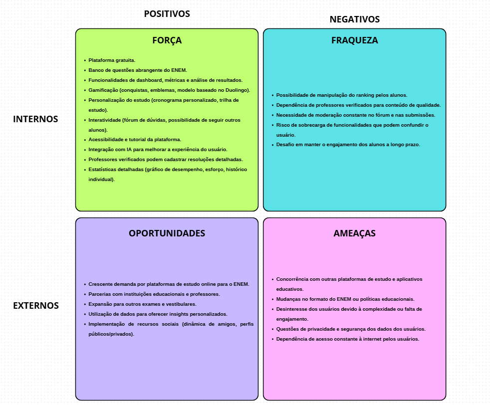

# Matriz SWOT para o Site de Banco de Questões do ENEM

## 1. Introdução

A equipe utilizou da técnica de análise SWOT para planejamento dos pontos fortes e fracos internos, oportunidades e ameaças externas do site de banco de questões do ENEM. O membro [Giovanni](https://github.com/giovanniacg) realizou essa análise e fez a confecção da matriz SWOT que será apresentada a seguir.

## 2. Metodologia

Foi utilizada a técnica de análise SWOT, que consiste em identificar os pontos fortes e fracos internos do produto, bem como as oportunidades e ameaças externas. A análise SWOT é uma ferramenta de gestão estratégica que permite avaliar o ambiente interno e externo de um produto, identificando fatores críticos para o sucesso do produto.

### 2.1 Aplicação da Metodologia

Para a metodologia é importante analisarmos os fatores internos, como recursos, capacidades, processos e cultura organizacional, e externos, ambiente macroeconômico, concorrência, mudanças regulatórias e tendências de mercado, colaborando assim para cada ponto dentro do produto. A seguir falamos sobre a divisão que há dentro de cada fator:

* **Internos:**
    * **Força:** Pontos positivos que o produto pode oferecer ao mercado, como diferenciais, qualidade, inovação, etc.

    * **Fraqueza:** Pontos negativos que o produto possui, como falta de recursos, processos ineficientes, baixa qualidade, etc.

* **Externos:**
    * **Oportunidades:** Fatores que podem ser explorados pelo produto, como tendências de mercado, mudanças regulatórias, novas tecnologias, etc.

    * **Ameaças:** Fatores que podem impactar negativamente o produto, como concorrência, mudanças no mercado, segurança, dependências, etc.

## 3. Matriz SWOT

A imagem abaixo apresenta o diagrama elaborado:

## 4. Análise e Conclusão

A Matriz SWOT desenvolvida apresenta diversos pontos positivos e negativos para o produto. Foi possível identificar dentro dos pontos positivos, grandes pontos importantes para o objetivo do produto e diferenciais com concorrentes que podem o favoreces, além de boas oportunidades para crescente no mercado e novas features, por outro lado, dentro dos pontos negativos foi possível identificar o que pode ser melhorado e o que pode ser um problema para o produto, assim levando a equipe a pensar em como contornar esses problemas durante o desenvolvimento do produto.

## Referências Bibliográficas

> <a id="REF1" href="https://www.gov.br/transportes/pt-br/assuntos/portal-da-estrategia/artigos-gestao-estrategica/matriz-swot-e-a-gestao-da-qualidade">1.</a> BRASIL.Ministério dos Transportes. Matriz SWOT e a gestão da Qualidade. Brasília: Minstério dos Transportes. Disponível em: https://www.gov.br/transportes/pt-br/assuntos/portal-da-estrategia/artigos-gestao-estrategica/matriz-swot-e-a-gestao-da-qualidade.

## Histórico de Versão

| Versão | Data | Descrição | Autor(es) | Revisor(es) |
|:---:|:---:|:---|:---:|:---:|
| `1.0` | 03/11/2024 | Criação do documento | [Felipe Motta](https://github.com/M0tt1nh4) | - |