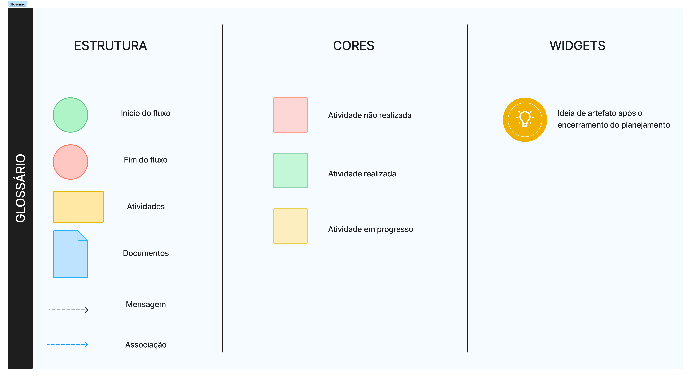
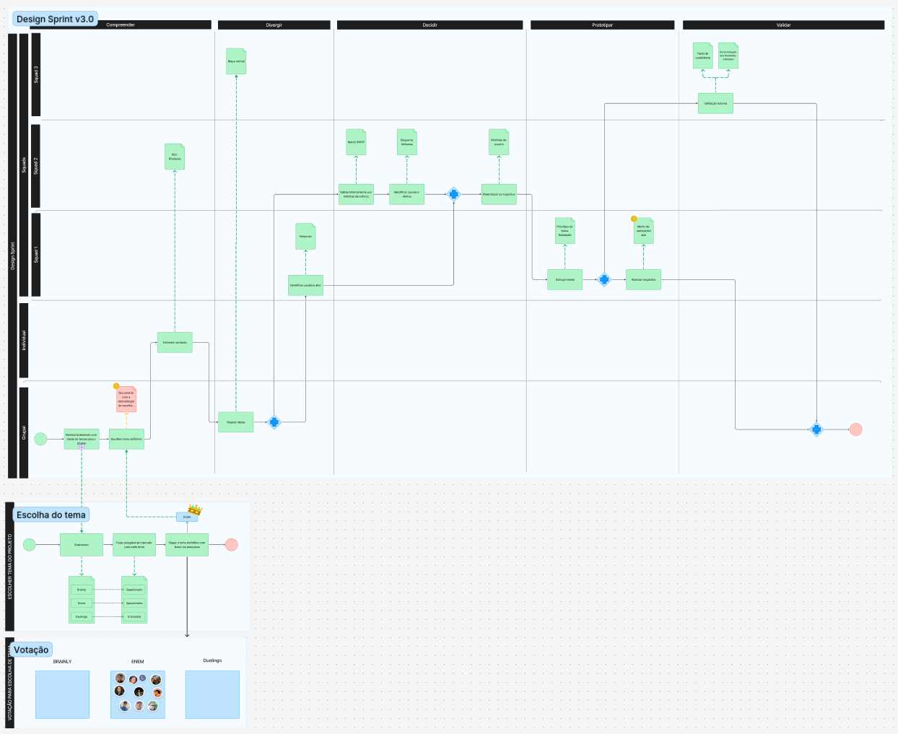

# Design Sprint

## 1. Introdução

Este documento apresenta a criação e evolução do design sprint elaborado pelo grupo, utilizando o modelo BPMN (Business Process Model and Notation). O objetivo é detalhar as três versões desenvolvidas, destacando as melhorias e ajustes realizados até a entrega final. A modelagem em BPMN permitiu uma visualização clara dos processos e facilitou a identificação de pontos de melhoria ao longo do projeto.

## 2. Metodologia

Para a elaboração do design sprint, utilizamos a notação BPMN para modelar os processos de forma padronizada e compreensível. A cada versão, aplicamos técnicas de análise de processos e coletamos feedback dos envolvidos para refinar o modelo.

### 2.1 Aplicação da Metodologia BPMN

Seguimos os padrões do BPMN, utilizando símbolos e convenções reconhecidos internacionalmente. A ferramenta utilizada foi o **Figma**, que auxiliou na criação e edição dos diagramas.

### 2.2 Glossário de Cores e Formas

Para um melhor entendimento dos diagramas, preparamos um glossário detalhando as cores e formas utilizadas:

<figure markdown>

<b>Figura 1</b> - Glossário de Cores e Formas

Fonte: [Giovanni Giampauli](https://github.com/giovanniacg)

</figure>

## 3. Evolução das Versões do Design Sprint

Nesta seção, apresentamos as três versões do modelo BPMN desenvolvidas ao longo do projeto, destacando as principais alterações e melhorias implementadas.

### 3.1 Versão 1.0

A primeira versão focou em um modelo geral da entrega, com apenas três raias gerais e duas fases genéricas.

<figure markdown>

<b>Figura 2</b> - Design Sprint BPMN Versão 1.0

Fonte: [Giovanni Giampauli](https://github.com/giovanniacg)

</figure>

### 3.2 Versão 2.0

Na segunda versão, adicionamos mais raias relacionadas aos squads, além de separar as fases conforme as etapas do design sprint. Também adicionamos um relacionamento com um subprocesso que mostra a escolha do tema do grupo. Como pode ser observado, existem algumas tarefas e artefatos que ainda estão em vermelho (não concluído) e em amarelo (em desenvolvimento), pois com a chegada da versão 3.0, a versão 2.0 se tornou legado para o time.

<figure markdown>

<b>Figura 3</b> - Design Sprint BPMN Versão 2.0

Fonte: [Giovanni Giampauli](https://github.com/giovanniacg)

</figure>

### 3.3 Versão 3.0

A versão final refinou os detalhes, adicionando fluxos de paralelismo das tarefas, além de incluir artefatos provenientes de ideias surgidas após o planejamento ter sido finalizado.

<figure markdown>

<b>Figura 4</b> - Design Sprint BPMN Versão 3.0

Fonte: [Giovanni Giampauli](https://github.com/giovanniacg)

</figure>

## 4. Melhorias Implementadas

- **Detalhamento dos Processos**: Aprofundamos a descrição de cada etapa, adicionando tarefas e eventos específicos.
- **Feedback Incorporado**: Realizamos ajustes com base nas sugestões dos membros do grupo.
- **Otimização do Fluxo**: Identificamos e eliminamos redundâncias e gargalos no processo.

## 5. Análise e Conclusão

A evolução do modelo BPMN ao longo das três versões permitiu um refinamento contínuo do design sprint, resultando em um processo mais eficiente e alinhado com os objetivos do projeto. O uso do BPMN facilitou a comunicação entre os membros do grupo e contribuiu para a identificação de melhorias significativas, fazendo com que todos os squads participassem das fases do Design sprint.

## 6. Referências Bibliográficas

> <a id="REF1" href="#anchor_1">1.</a> Ribeiro, M. (2024). _Arquitetura e Desenho de Software - Aula BPMN Exemplos_. Disponível em: [https://aprender3.unb.br/pluginfile.php/2928935/mod_page/content/1/Arquitetura%20e%20Desenho%20de%20software%20-%20Aula%20BPMN%20Exemplos%20-%20Profa.%20Milene.pdf](https://aprender3.unb.br/pluginfile.php/2928935/mod_page/content/1/Arquitetura%20e%20Desenho%20de%20software%20-%20Aula%20BPMN%20Exemplos%20-%20Profa.%20Milene.pdf). Acesso em: 01/11/2024.

> <a id="REF2" href="#anchor_2">2.</a> IProcess. (2021). _Diferenças entre os Gateways de BPMN com Animações_. Disponível em: [https://blog.iprocess.com.br/2021/05/diferencas-entre-os-gateways-de-bpmn-com-animacoes/](https://blog.iprocess.com.br/2021/05/diferencas-entre-os-gateways-de-bpmn-com-animacoes/). Acesso em: 01/11/2024.

## Histórico de Versão

| Versão | Data       | Data de Revisão | Descrição             | Autor(es)                                           | Revisor(es) | Detalhes da revisão |
| ------ | ---------- | --------------- | --------------------- | --------------------------------------------------- | ----------- | -------------------- |
| 1.0    | 01/11/2024 | 02/11/2024      | Criação do documento  | [Giovanni Giampauli](https://github.com/giovanniacg) | N/D | N/D |
