# ***Protótipo***

## **1. Introdução**

Um protótipo é uma versão preliminar de um produto ou sistema que permite visualizar e testar funcionalidades antes de sua implementação final. No desenvolvimento de software, protótipos são fundamentais para validar conceitos, identificar problemas de usabilidade e alinhar expectativas entre desenvolvedores, stakeholders e usuários finais.

A criação de protótipos ajuda a reduzir custos e a agilizar o processo de desenvolvimento, pois facilita ajustes iniciais e reduz o risco de retrabalho. Eles podem variar desde esboços de baixa fidelidade (como wireframes) até versões interativas de alta fidelidade, que simulam a experiência do produto final.

## **2. Objetivo**

O objetivo de um protótipo de baixa fidelidade é representar de maneira simplificada a estrutura, o fluxo e as principais funcionalidades de uma interface, permitindo testes e validações iniciais. Esse tipo de protótipo é ideal para coletar feedback rápido dos usuários e stakeholders, possibilitando ajustes no conceito antes de investir em desenvolvimento detalhado.

Com foco na organização de elementos e na experiência de navegação, o protótipo de baixa fidelidade ajuda a identificar problemas de usabilidade e compreender melhor as expectativas dos usuários.

## **3. Metodologia**

Para a construção do protótipo de baixa fidelidade, utilizamos uma abordagem colaborativa que incluiu sessões de brainstorming e criação de um mapa mental. Abaixo detalhamos as etapas seguidas:

1. **Brainstorming:** Realizamos uma sessão de brainstorming com a equipe e os stakeholders para discutir ideias e funcionalidades desejadas. Esse processo nos permitiu explorar as necessidades do projeto e alinhar as expectativas sobre as funcionalidades e a experiência do usuário.
   - **[Brainstorming](../DesignSprint/brainstorming.md)**

2. **Mapa Mental:** A partir das ideias geradas no brainstorming, criamos um mapa mental que organiza os principais elementos e fluxos do sistema. Esse mapa mental foi fundamental para visualizar a estrutura geral do protótipo e identificar as interações necessárias entre as telas e os componentes.
   - **[Mapa Mental do Projeto](../DesignSprint/mapa-mental.md)**

3. **Desenvolvimento das Telas:** Com o mapa mental como guia, desenhamos as telas iniciais do protótipo. Cada tela foi criada para refletir as ideias discutidas, com foco na disposição dos elementos e na navegação entre as diferentes seções.
   - **[Protótipo de Baixa Fidelidade - Telas](https://www.figma.com/design/OULlKQ9XGHSrkX6I9RD5QS/Prot%C3%B3tipo-de-Baixa-Fidelidade?node-id=0-1&t=aRTjdciWnN3Hqw9p-1)**

Esses artefatos foram fundamentais para estruturar o protótipo de maneira lógica e prática, garantindo que os conceitos principais pudessem ser testados e ajustados conforme o feedback dos usuários.

## **4. Protótipo**

<iframe style="border: 1px solid rgba(0, 0, 0, 0.1);" width="800" height="450" src="https://embed.figma.com/design/OULlKQ9XGHSrkX6I9RD5QS/Prot%C3%B3tipo-de-Baixa-Fidelidade?node-id=0-1&embed-host=share" allowfullscreen></iframe>

_Fonte: [Arthur Alves](https://github.com/arthrok) e [Paulo Henrique](https://github.com/paulomh)_

### **4.1. Descrição das Telas**

- Tela 1: Início - User não logado

   - **Descrição:** Tela inicial da aplicação. Deve conter elementos que permitam ao usuário navegar para as demais áreas do site.
   - **Observação:** Nenhuma observação adicional no momento.
   
   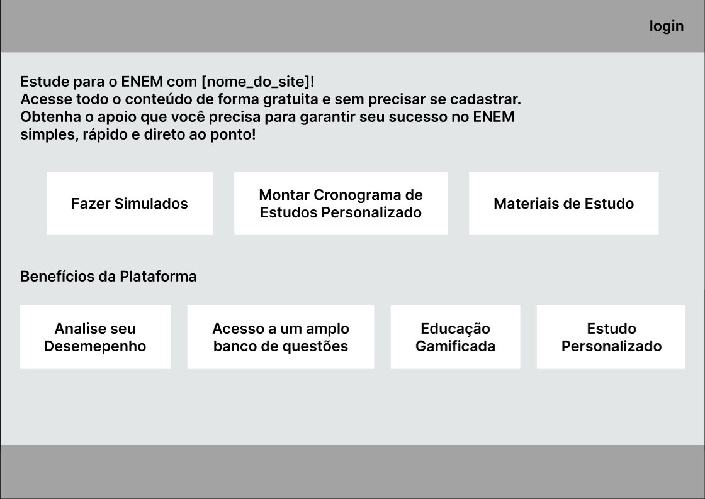 
   
- Tela 1.1: Login

   - **Descrição:** Tela de login do usuário. Deve conter um pequeno formulário para login e uma opção para recuperar senha e, caso seja um usuário novo, ser direcionado para tela de cadastro.
   - **Observação:** Possibilidade de colocar formas alternativas de login.

   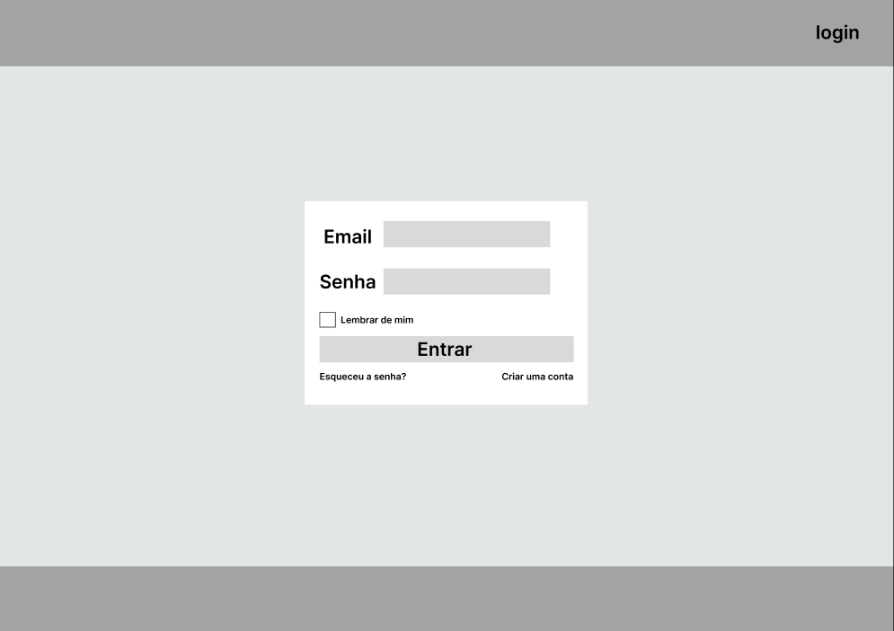 

- Tela 1.2: Cadastro

   - **Descrição:** Tela de cadastro do usuário. Essa tela deve conter um formulário para cadastro tanto de aluno ou de professor.
   - **Observação:** Nenhuma observação adicional no momento.

   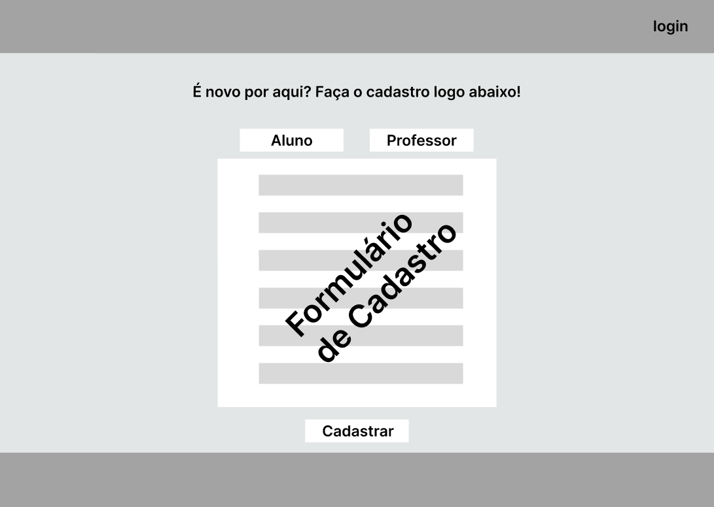 

- Tela 1.3: Início - User logado

   - **Descrição:** Tela inicial da aplicação. Deve conter elementos que permitam ao usuário navegar para as demais áreas do site.
   - **Observação:** Nenhuma observação adicional no momento.

   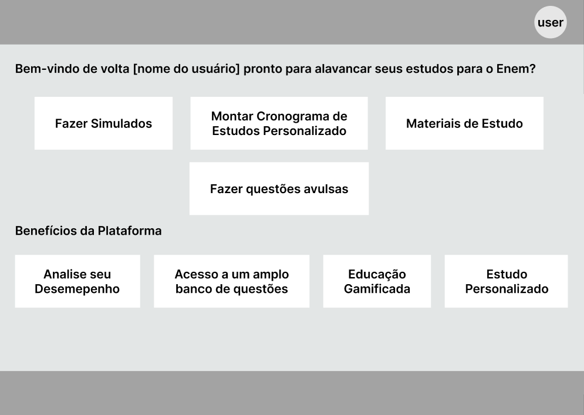 

- Tela 2: Perfil - Dashboard

   - **Descrição:** Tela que possuirá um dashboard com dados relacionados as questões e\ou simulados feitos pelo usuário. Além disso, esta tela possuirá a foto de perfil do usuário e um pequeno mural contendo seus badges\conquistas. Nesta tela, o usuário poderá editar seus dados pessoais e editar quais badges\conquistas aparecerão para outros usuários, além de ter uma breve descrição sobre o usuário.
   - **Observação:** Apenas usuários cadastrados terão acesso a essa tela.

   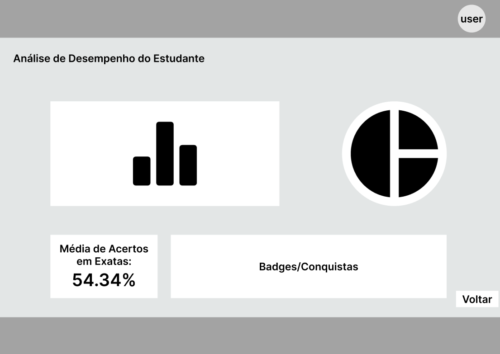 

- Tela 3: Opções do simulado

   - **Descrição:** Tela que permitirá ao usuário escolher as opções do simulado, como: ano da prova, distribuição de questões, dia prova, se deseja incluir cronômetro, se deseja definir um tempo máximo para fazer o simulado, entre outros.
   - **Observação:** Apenas usuários logados terão acesso a essa tela.

   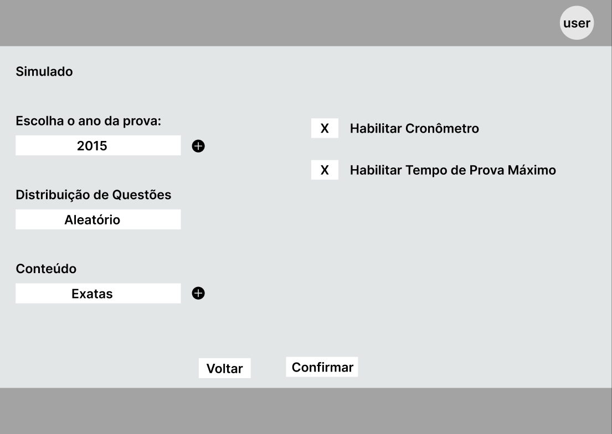 

- Tela 3.1: Simulado

   - **Descrição:** Tela que seguirá o formato da prova do Enem, contendo apenas questões de um dos dias escolhidos pelo usuário e, ao final do simulado, conterá uma parte dedicada para a redação.
   - **Observação:** Esta tela também se repetirá N vezes com base na quantidade de questões da prova e apenas usuários logados poderão ter acesso a ela.

   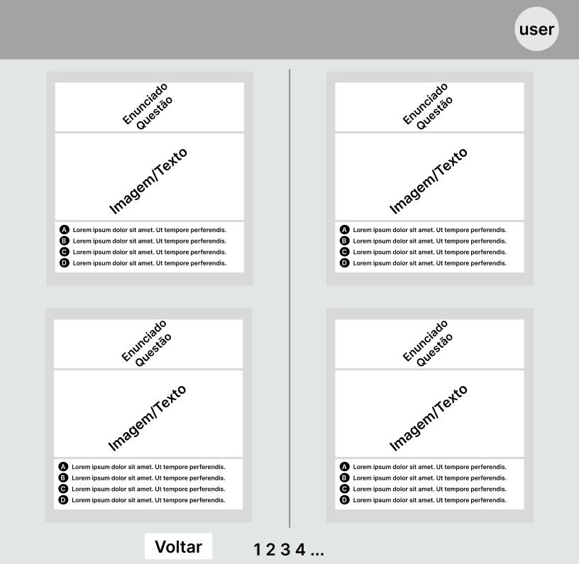 

- Tela 4: Criação de questões

   - **Descrição:** Tela que permitirá professores cadastrados criarem suas próprias questões seguindo o padrão de formato do Enem. Nesta tela, o professor poderá preencher um formulário contendo um enunciado, área relacionada, matéria relacionada e conteúdo relacionado, além de definir as alternativas e, se necessário, anexar imagens. Ao lado do formulário, haverá um componente que permitirá ao professor visualizar como a questão ficará no formato do Enem.
   - **Observação:** Apenas professores cadastrados e verificados terão acesso a essa tela.  

   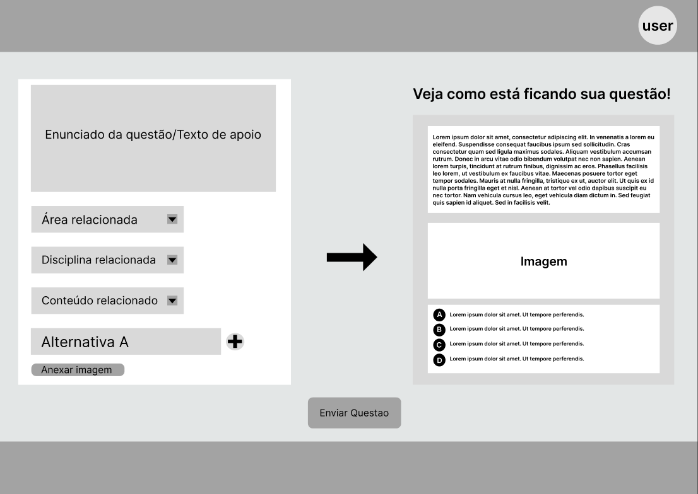 

- Tela 4.1: Questões

   - **Descrição:** Tela com questões do Enem. No início da tela ficarão opções para filtrar as questões com base em critérios decididos posteriormente e um botão para aplicar o filtro. No restante da tela, ficará visível um número definido de questões seguindo o padrão: enunciado, imagem (se tiver), alternativas em forma de cascata.
   - **Observação:** O usuário não logado conseguirá visualizar as questões, mas não as responder. Note que esta tela se repetirá N vezes.

    

- Tela 5: Ranking
   
   - **Descrição:** Tela que mostrará um ranking com os usuários que mais acertaram questões do Enem. O ranking possuirá um top 3 com os alunos mais dedicados à plataforma e uma lista com o restante dos usuários.
   - **Observação:** Apenas usuários logados terão acesso a essa tela.

   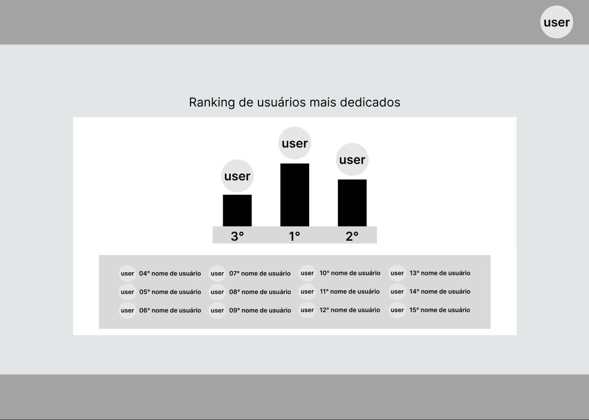 
   
- Tela 6: Materiais de estudo

   - **Descrição:** Tela que conterá materiais de estudo para o Enem. Nesta tela, o usuário poderá escolher entre diferentes áreas de conhecimento e, ao clicar em uma área, será direcionado para uma tela com materiais de estudo relacionados a essa área.
   - **Observação:** Apenas usuários logados terão acesso a essa tela.

   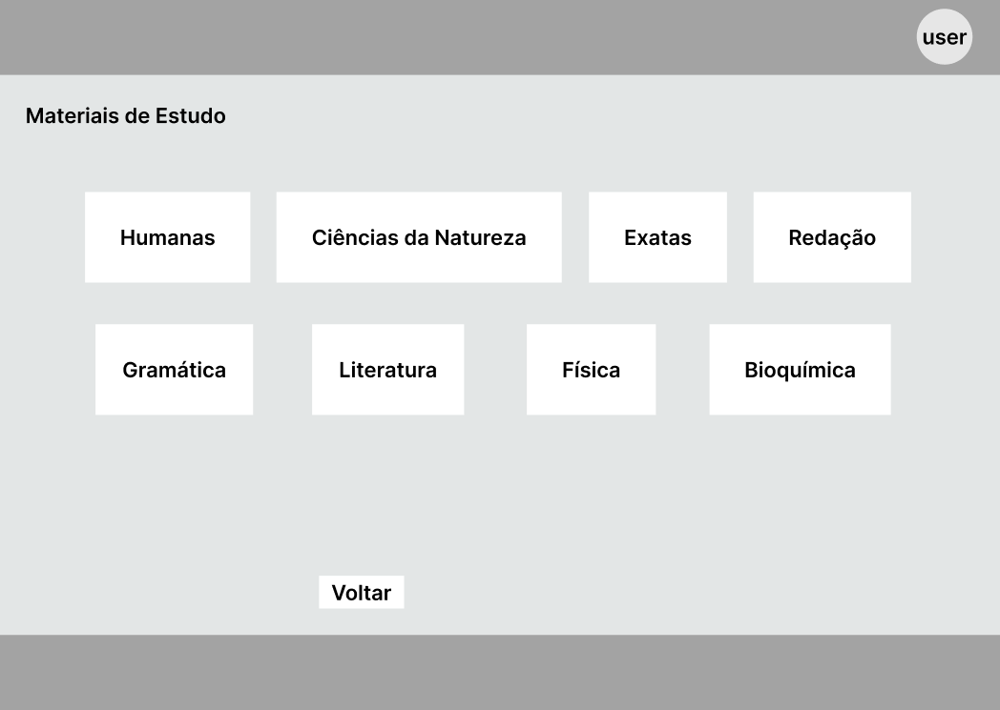 

- Tela 6.1: Cronograma de estudos

   - **Descrição:** Tela que permitirá ao usuário criar um cronograma de estudos personalizado com base nos materiais de estudos. Nesta tela, o usuário poderá escolher entre diferentes áreas de conhecimento para definir no cronograma.
   - **Observação:** Apenas usuários logados terão acesso a essa tela.

   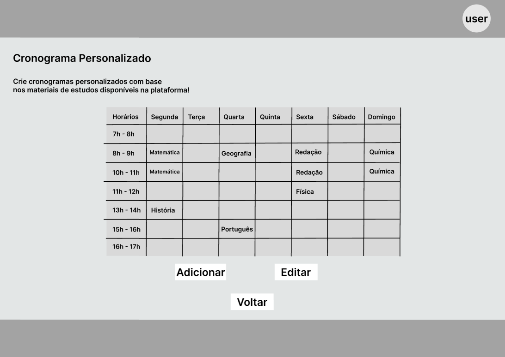

## <a>Bibliografia</a>

> SERRANO, Milene. SERRANO, Maurício. Requisitos - Aula 23.

## <a>Histórico de Versão</a>

| Versão | Data | Descrição | Autor(es) | Revisor(es) |
| ------ | ---- | --------- | --------- | ---------- |
| `1.0`  | 02/11/2024 | Criação do documento Protótipo  | [Arthur Alves](https://github.com/arthrok) e [Paulo Henrique](https://github.com/paulomh)  | [Diego Sousa](https://github.com/DiegoSousaLeite) e [Julio Cesar](https://github.com/julio-dourado) |
| `1.1`  | 02/11/2024 | Adição adição da seção 4.1 | [Paulo Henrique](https://github.com/paulomh) | [Diego Sousa](https://github.com/DiegoSousaLeite) e [Julio Cesar](https://github.com/julio-dourado) |
| `1.2`  | 03/11/2024 | Correção seção 4.1 | [Paulo Henrique](https://github.com/paulomh) | [Diego Sousa](https://github.com/DiegoSousaLeite) e [Julio Cesar](https://github.com/julio-dourado) |